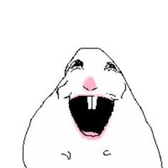

# Clase 01

## Apuntes de clase 
- Aprendimos a poner una imágen  
Fórmula 1: ! [Desc.] (link)  
Fórmula 2: Arrastrando desde la carpeta de archivos. *Pero el link puede cambiar, en cambio con la fórmula 1 no

Ej:   

    

  
  - Conversamos sobre el texto "La estética como cosmología" de Graham Harman 
## Tareas  

  **I.** Analizar las obras de Mateo Cereceda y Gabriela Inostroza en la muestra *Analog ROOT* de la galería UNIACC según lo visto en clases (ontología de objetos y metáfora)  

    A. 
    "neoHaikus v2", Gabriela Inostroza
    B. 
    "Donante universal", Mateo Cereceda  

      
  **II.** Elegir 2 objetos y mencionar 10 cualidades de cada uno  

