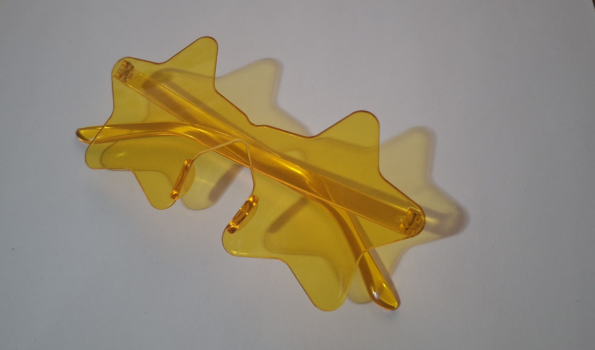
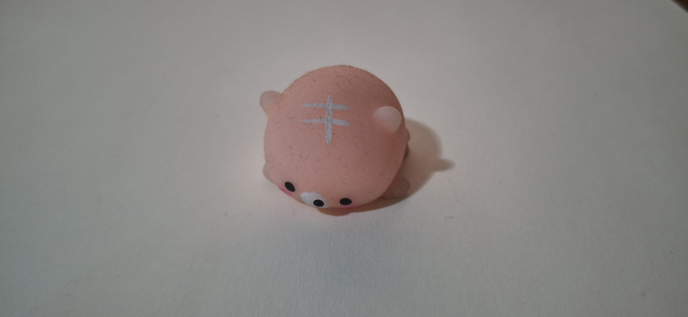

# Clase 01

## Apuntes de clase 
- Aprendimos a poner una imágen  
Fórmula 1: ! [Desc.] (link)  
Fórmula 2: Arrastrando desde la carpeta de archivos. *Pero el link puede cambiar, en cambio con la fórmula 1 no

Ej:   

  - Conversamos sobre el texto "La estética como cosmología" de Graham Harman

        
## Tareas  
  **I. Analizar las obras de Mateo Cereceda y Gabriela Inostroza en la muestra *Analog ROOT* de la galería UNIACC según lo visto en clases (ontología de objetos y metáfora)**  
    
  *NOTA:  
  Ontología: qué es como objeto, no que significa/ respetar su existencia  
          Metáfora: contraposicion de 2 conceptos distintos/ interpretar   

  
A.   
 "neoHaikus v2", Gabriela Inostroza  

 La obra ramifica el ser del grillo, su figura aparece conviviendo en un entorno digital (bicho sobre el pc) y natural (bicho sobre una hoja), lo digital se conecta con los pensamientos (haikus) y lo natural a su canto, a su vez ambas son conectadas por el botón que hace al grillo cantar dando haikus. 
 

            
B.   
"Donante universal", Mateo Cereceda  
 
El tubo de vidro se llena de esta "sangre" para luego vaciarse, referenciando a su título, como donantes universales que crean para si mismos (se llenan) y para los demás (se vacían) 

  **II. Elegir 2 objetos y mencionar 10 cualidades de cada uno** 
   
  *A. Lentes*  
  

*1. Accesorio    
2. Semi transparente  
3. Refleja luz amarilla  
4. Ligero  
5. Cómodo  
6. Forma de estrella  
7. Bordes redondeados  
8. Llamativo  
9. Divertido   
10. Visión cálida*  
  
  *B. Squishy*  
  

*1. Pegajoso  
2. Pequeño  
3. Ligero  
4. Sucio  
5. Oloroso  
6. Diseño simple   
7. Aplastable  
8. Estampado chueco   
9. Tierno  
10. Base rosa pálido*

